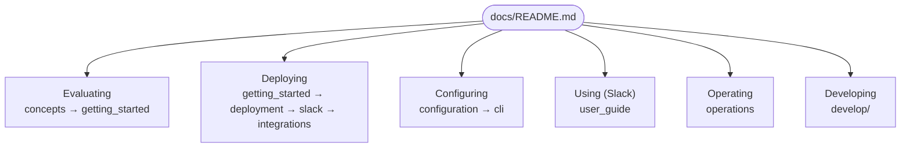

# Hecatoncheires Documentation

Start here. Pick the path that matches what you are trying to do.

## Reading paths by audience

### Evaluating the product — "what is this and what can it do?"
1. [Concepts](concepts.md) — the vocabulary and how the pieces relate
2. [Getting Started](getting_started.md) — run it locally in minutes

### Deploying — "how do I stand it up?"
1. [Getting Started](getting_started.md)
2. [Deployment](deployment.md) — Firestore, Cloud Storage, LLM provider, secrets
3. [Slack Integration](slack.md) — Slack App setup (OAuth, Events, Interactivity, Slash, Enterprise Grid)
4. [Integrations](integrations.md) — Notion and GitHub

### Configuring — "how do I customize it?"
1. [Configuration](configuration.md) — the complete `config.toml` reference
2. [CLI Reference](cli.md) — subcommands, flags, and environment variables

### Using it on Slack — "how do I operate it day to day?"
- [User Guide](user_guide.md) — case creation, drafts, actions, AI chat, automation, notifications, import

### Operating — "how do I monitor and maintain it?"
- [Operations](operations.md) — observability (Sentry), `tick`/`migrate`/`diagnosis`, backup & data migration

### Developing — "how does it work inside, and how do I extend it?"
- [develop/](develop/README.md) — contributor entry point, rule-placement map, and [Architecture (internals)](develop/architecture.md)

## Full index

| Document | Description |
|---|---|
| [concepts.md](concepts.md) | Core concepts and glossary |
| [getting_started.md](getting_started.md) | Run locally (memory backend, no auth) |
| [deployment.md](deployment.md) | Production deployment overview |
| [configuration.md](configuration.md) | `config.toml` complete reference |
| [cli.md](cli.md) | CLI subcommands, flags, environment variables |
| [eval.md](eval.md) | Offline scenario-based evaluation of LLM workflows |
| [slack.md](slack.md) | Slack App setup and integration |
| [integrations.md](integrations.md) | Notion and GitHub integrations |
| [mcp.md](mcp.md) | MCP server (read-only Workspace/Case/Action tools, Rego authorization) |
| [user_guide.md](user_guide.md) | End-user guide (Slack workflows) |
| [operations.md](operations.md) | Operations and runbook |
| [develop/README.md](develop/README.md) | Developer entry point |
| [develop/architecture.md](develop/architecture.md) | Internal architecture |
