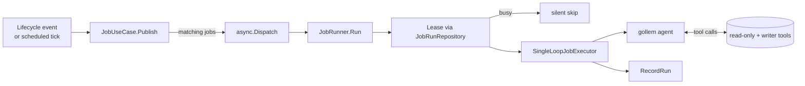

# Event-Driven Agent Jobs

Agent Jobs let workspace administrators declaratively wire LLM-powered
automation to Case lifecycle events and periodic ticks. Each Job is
defined in the workspace TOML, listens to one or more events, and runs
the Plan-and-Execute agent runtime with a fixed system-prompt structure
and a curated tool palette (read-only + writer).

## When a Job runs

Two event domains can trigger a Job:

| Domain      | When it fires |
|-------------|---------------|
| `case`      | Case lifecycle transitions (`created`, `closed`). Fired by `CaseUseCase` immediately after persistence. |
| `scheduled` | A duration (`every`) or cron expression (`cron`) elapsed since the last successful run. Fired by the `hecatoncheires tick` CLI or the `POST /hooks/tick` endpoint. |

A Job may subscribe to multiple domains; the runtime fires one
invocation per matching `(job, case)` tuple.

## TOML schema

```toml
# A minimal lifecycle Job.
[[job]]
id = "summarize-on-create"
name = "Auto-summarize on creation"
description = "Summarize a new case and post the summary to Slack."
events.case = { on = ["created"] }
prompt = """
Summarize this case in three lines or fewer and post it to the Slack channel
bound to the case via slack__post_to_case_channel.
"""

# A multi-trigger Job: fires on lifecycle events AND every hour.
[[job]]
id = "watch"
events.case = { on = ["created", "closed"] }
events.scheduled = { every = "1h" }
prompt = "Take any appropriate action..."

# A cron-based scheduled Job.
[[job]]
id = "daily-digest"
events.scheduled = { cron = "0 9 * * *" }  # 09:00 UTC every day
prompt = "Post a status digest to the case Slack channel."
```

### Fields

| Field         | Type     | Required | Notes |
|---------------|----------|----------|-------|
| `id`          | string   | yes      | Workspace-unique, kebab-case. |
| `name`        | string   | no       | Human-readable label for logs. |
| `description` | string   | no       | Free-form description for operators. |
| `prompt`      | string   | yes      | Go `text/template`. Has access to `.Case`, `.Workspace`, `.Event`. |
| `disabled`    | bool     | no       | Defaults to `false` (= active). Set `true` to temporarily disable. |
| `events.case` | table    | (\*)     | `on = ["created" \| "closed", ...]`. Always an array. |
| `events.scheduled` | table | (\*)   | Exactly one of `every = "1h"` or `cron = "0 9 * * *"`. |

(\*) At least one of `events.case` / `events.scheduled` must be present.

## System prompt

The runtime constructs a structured system prompt every invocation. The
contents are fixed by the runtime — Job authors only control
`prompt` (the user message).

| Section             | Content |
|---------------------|---------|
| Role                | Agent role and tone (fixed text). |
| Workspace           | `id`, `name`, `description`, custom field schema. |
| Case                | All persisted fields of the current case. |
| Actions             | Existing non-archived actions, for de-duplication. |
| Trigger condition   | The Job's declared subscription (events.case / events.scheduled). |
| Trigger reason      | The concrete event that fired this invocation (timestamps, actor, lifecycle / cron tick). |
| Guardrails          | Fixed restrictions: no auto-close, no delete, channel-scoped Slack, etc. |
| Tools               | gollem auto-injects the resolved tool list. |

## Tools available to a Job

Read-only:
- `core__list_actions`, `core__get_action`, `core__list_action_steps`
- Slack search / channel-history (via `slack_ro`)
- Notion search / page-get (via `notion`)
- GitHub search (via `github`)

Writer (Job-only):
- `core__create_action`, `core__update_action`, `core__update_action_status`, `core__set_action_assignee`
- `core__add_action_step`, `core__set_action_step_done`, `core__rename_action_step`
- `case__update_case` — title / description / assignees only; status changes and deletion are **not** exposed
- `slack__post_to_case_channel` — fixed to `Case.SlackChannelID`; arbitrary channels are not exposed

Writer mutations run as `model.SystemActorID` (`"@system"`). The
`CaseUseCase.UpdateCase` path skips Slack user-token permission checks
when the actor is the system identifier.

## Lifecycle of an invocation



### Concurrency

The `JobRunRepository` provides a per-(workspace, case, job) lease. A
second invocation that arrives while the first holds the lease is
**silently skipped** — duplicate triggers from rapid lifecycle toggles
or two scheduler ticks landing close together are absorbed safely.

The default lease is 10 minutes. `RecordRun` clears the lease on
completion; if the runner crashes the lease times out on its own.

### Loop suppression

Mutations a Job's tool performs run with a context-marker
(`job.JobActorMarker`). `JobUseCase.Publish` returns early when it sees
this marker, so a Job that touches `case__update_case` cannot trigger
itself again.

## Running scheduled Jobs

There are two entry points for the time-driven sweep. Both end in the
same `ScheduledScanner.Scan` call.

### CLI: one-shot sweep

```sh
$ hecatoncheires tick --config /etc/hecatoncheires/workspaces/
```

Suitable for `cron`, GitHub Actions, or any external timer. The command
exits when the sweep and every dispatched Job goroutine finish.

### HTTP: `POST /hooks/tick`

Available on the `hecatoncheires serve` HTTP server. Wire to Cloud
Scheduler / Eventarc / your preferred scheduler. The endpoint:

- Is **unauthenticated by design.** Deploy behind IAP / Cloud Run
  internal-only ingress / private networking. Do NOT expose to the
  public internet.
- Responds `200` immediately; the sweep runs in a background goroutine.
- Ignores the request body.

## Failure handling

- Job validation errors (TOML schema, unknown lifecycle value, bad cron):
  loud failure at config load — startup aborts.
- LLM errors / tool errors during a run: recorded via `errutil.Handle`
  (Sentry-bound) and persisted to `JobRunRepository` as `FAILED`.
- Workspace / case loading failures inside the runner: recorded as
  `FAILED`; the lease is released so a retry can pick up.

## Operational tips

- Treat the `prompt` as the only place to encode Job-specific behaviour;
  everything else is fixed by the runtime.
- For high-frequency scheduled Jobs, set `every` to a value greater than
  your expected sweep cadence so the duration-since-last-run check absorbs
  scheduler jitter.
- Use the `JobRunRepository.List` API (over `workspaceID`) to surface
  per-Job state in an observability dashboard.
