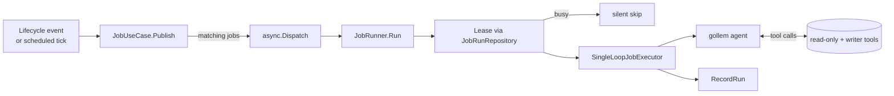

# Event-Driven Agent Jobs

Agent Jobs let workspace administrators declaratively wire LLM-powered
automation to Case lifecycle events and periodic ticks. Each Job is
defined in the workspace TOML, listens to one or more events, and runs
the Plan-and-Execute agent runtime with a fixed system-prompt structure
and a curated tool palette (read-only + writer).

## When a Job runs

Two event domains can trigger a Job:

| Domain      | When it fires |
|-------------|---------------|
| `case`      | Case lifecycle transitions (`created`, `closed`). Fired by `CaseUseCase` immediately after persistence. |
| `scheduled` | A duration (`every`) or cron expression (`cron`) elapsed since the last successful run. Fired by the `hecatoncheires tick` CLI or the `POST /hooks/tick` endpoint. |

A Job may subscribe to multiple domains; the runtime fires one
invocation per matching `(job, case)` tuple.

## TOML schema

```toml
# A minimal lifecycle Job.
[[job]]
id = "summarize-on-create"
name = "Auto-summarize on creation"
description = "Summarize a new case and post the summary to Slack."
events.case = { on = ["created"] }
prompt = """
Summarize this case in three lines or fewer and post it to the Slack channel
bound to the case via slack__post_to_case_channel.
"""

# A multi-trigger Job: fires on lifecycle events AND every hour.
[[job]]
id = "watch"
events.case = { on = ["created", "closed"] }
events.scheduled = { every = "1h" }
prompt = "Take any appropriate action..."

# A cron-based scheduled Job.
[[job]]
id = "daily-digest"
events.scheduled = { cron = "0 9 * * *" }  # 09:00 UTC every day
prompt = "Post a status digest to the case Slack channel."
```

### Fields

| Field         | Type     | Required | Notes |
|---------------|----------|----------|-------|
| `id`          | string   | yes      | Workspace-unique, kebab-case. |
| `name`        | string   | no       | Human-readable label for logs. |
| `description` | string   | no       | Free-form description for operators. |
| `prompt`      | string   | yes      | Go `text/template`. Has access to `.Case`, `.Workspace`, `.Event`. |
| `disabled`    | bool     | no       | Defaults to `false` (= active). Set `true` to temporarily disable. |
| `events.case` | table    | (\*)     | `on = ["created" \| "closed", ...]`. Always an array. |
| `events.scheduled` | table | (\*)   | Exactly one of `every = "1h"` or `cron = "0 9 * * *"`. |

(\*) At least one of `events.case` / `events.scheduled` must be present.

## System prompt

The runtime constructs a structured system prompt every invocation. The
contents are fixed by the runtime — Job authors only control
`prompt` (the user message).

| Section                  | Content |
|--------------------------|---------|
| Role                     | Agent role and tone (fixed text). |
| Workspace                | `id`, `name`, `description`, and the custom field schema. Each field's `id`, `name`, `type`, `required` flag (when true), `description` (when set), and — for `select` / `multi-select` — every option's `id`, `name`, `description`, and freeform metadata pairs are emitted so the agent knows the field's constraints and the meaning of each option ID. |
| Case                     | All persisted fields of the current case. For `field_values`, `select` / `multi-select` entries are rendered as `id: <raw> (<option name>, ...)` so the agent can map raw option IDs back to their human-readable label without re-consulting the schema. Unknown option IDs fall back to the raw value. |
| Per-case operator notes  | Rendered only when the Case has `AgentAdditionalPrompt` set (see below). |
| Actions                  | Existing non-archived actions, for de-duplication. |
| Trigger condition        | The Job's declared subscription (events.case / events.scheduled). |
| Trigger reason           | The concrete event that fired this invocation (timestamps, actor, lifecycle / cron tick). |
| Guardrails               | Fixed restrictions: no auto-close, no delete, channel-scoped Slack, etc. |
| Tools                    | gollem auto-injects the resolved tool list. |

### Per-case agent customisation

The Case Agent page (`/ws/{ws}/cases/{id}/agent`) lets operators attach
two Case-scoped knobs that the runtime applies on top of the TOML Job
definition:

- **Additional prompt**: a Markdown snippet (max 16,384 bytes) that is
  rendered into the `Per-case operator notes` section of the system
  prompt. It does **not** replace the TOML prompt or the Guardrails —
  treat it as extra context, not as a way to grant new capabilities.
- **Source allowlist** (`AgentSourceIDs`): when empty, every enabled
  Workspace Source remains in play. When non-empty, Source-aware tools
  MUST narrow themselves to the listed IDs. Unknown / deleted IDs are
  silently skipped at use time so a Source toggled off later does not
  invalidate the stored selection.

Both values round-trip through the `updateCaseAgentSettings` GraphQL
mutation. Drafts cannot carry agent settings (they have no Slack
channel and no Job runs against them).

## Tools available to a Job

Read-only:
- `core__list_actions`, `core__get_action`, `core__list_action_steps`
- Slack search / channel-history (via `slack_ro`)
- Notion search / page-get (via `notion`)
- GitHub search (via `github`)

Writer (Job-only):
- `core__create_action`, `core__update_action`, `core__update_action_status`, `core__set_action_assignee`
- `core__add_action_step`, `core__set_action_step_done`, `core__rename_action_step`
- `case__update_case` — title / description / assignees only; status changes and deletion are **not** exposed
- `slack__post_to_case_channel` — fixed to `Case.SlackChannelID`; arbitrary channels are not exposed

Writer mutations run as `model.SystemActorID` (`"@system"`). The
`CaseUseCase.UpdateCase` path skips Slack user-token permission checks
when the actor is the system identifier.

## Lifecycle of an invocation



### Concurrency

The `JobRunRepository` provides a per-(workspace, case, job) lease. A
second invocation that arrives while the first holds the lease is
**silently skipped** — duplicate triggers from rapid lifecycle toggles
or two scheduler ticks landing close together are absorbed safely.

The default lease is 10 minutes. `RecordRun` clears the lease on
completion; if the runner crashes the lease times out on its own.

### Loop suppression

Mutations a Job's tool performs run with a context-marker
(`job.JobActorMarker`). `JobUseCase.Publish` returns early when it sees
this marker, so a Job that touches `case__update_case` cannot trigger
itself again.

## Running scheduled Jobs

There are two entry points for the time-driven sweep. Both end in the
same `ScheduledScanner.Scan` call.

### CLI: one-shot sweep

```sh
$ hecatoncheires tick --config /etc/hecatoncheires/workspaces/
```

Suitable for `cron`, GitHub Actions, or any external timer. The command
exits when the sweep and every dispatched Job goroutine finish.

### HTTP: `POST /hooks/tick`

Available on the `hecatoncheires serve` HTTP server. Wire to Cloud
Scheduler / Eventarc / your preferred scheduler. The endpoint:

- Is **unauthenticated by design.** Deploy behind IAP / Cloud Run
  internal-only ingress / private networking. Do NOT expose to the
  public internet.
- Responds `200` immediately; the sweep runs in a background goroutine.
- Ignores the request body.

## Failure handling

- Job validation errors (TOML schema, unknown lifecycle value, bad cron):
  loud failure at config load — startup aborts.
- LLM errors / tool errors during a run: recorded via `errutil.Handle`
  (Sentry-bound) and persisted to `JobRunRepository` as `FAILED`. A
  matching `RUN_ERROR` entry is appended to the per-Run event log (see
  next section).
- Workspace / case loading failures inside the runner: recorded as
  `FAILED` on the JobRun lock doc; the lease is released so a retry can
  pick up. No `JobRunLog` is written for these *prepare-stage* failures
  because no RunID has been allocated yet.

## Run logs and event trail

Each invocation of a Job (= one *Run*) writes a structured log so the
agent's behaviour can be reconstructed after the fact. The log is
designed for rough flow tracing — "what was asked, what did the model
say, which tools were called with what arguments" — not exact byte-for-
byte reproduction.

### Identifiers

| ID | Scope | Generated by | Where it appears |
|----|-------|-------------|------------------|
| `RunID`   | One Run | `JobRunner.Run` (UUIDv7) | Doc ID of the `JobRunLog`; flat field on every `JobRunEvent`. |
| `TraceID` | One gollem trace | `JobRunner.Run` (UUIDv7) | Field on `JobRunLog` and every `JobRunEvent`. Logically distinct from `RunID` so a future plan-execute runtime can group multiple sub-agent traces under one Run. |

Both IDs are also mirrored onto the `JobRun` lock doc as `LastRunID` /
`LastTraceID` so a single read of the lock doc points at the latest log
without scanning the subcollection.

### Firestore layout

```
workspaces/{WorkspaceID}/cases/{CaseID}/jobRuns/{JobID}                     ← lock doc + last-run summary
workspaces/{WorkspaceID}/cases/{CaseID}/jobRuns/{JobID}/logs/{RunID}        ← JobRunLog (one per Run)
workspaces/{WorkspaceID}/cases/{CaseID}/jobRuns/{JobID}/logs/{RunID}/events/{Sequence}
                                                                            ← JobRunEvent (one per LLM call or tool call)
```

`Sequence` is a 20-digit zero-padded `uint64` so doc IDs sort
lexicographically the same way they sort numerically.

### `JobRunLog` fields (per Run)

- Identifiers: `WorkspaceID`, `CaseID`, `JobID`, `RunID`, `TraceID`
  (all top-level scalars, BigQuery-friendly).
- Lifecycle: `Stage` (`RUNNING` / `SUCCESS` / `FAILED`), `StartedAt`,
  `EndedAt`, `Error`.
- Runtime: `ExecutorKind` (v1: `"single_loop"`), `ExecutorVersion`.
- Provenance: `EventType` (e.g. `case`, `scheduled`), `EventTriggerAt`.
- `SystemPrompt`: the full system prompt, truncated from the tail at
  ~800 KiB. Held once per Run rather than duplicated on every LLM call.

### `JobRunEvent` kinds

Each event is one of:

| Kind            | When it appears |
|-----------------|-----------------|
| `LLM_REQUEST`   | Emitted at every LLM API call. Captures `Model`, the full message history sent, and the advertised tool list. |
| `LLM_RESPONSE`  | Paired with `LLM_REQUEST`. Captures `Texts`, `FunctionCalls`, `InputTokens`, `OutputTokens`, `DurationMs`. |
| `TOOL_CALL`     | One per tool execution. `ParentSequence` points at the LLM_RESPONSE whose tool_use spawned it. Captures `ToolName`, `ArgumentsJSON`, `ResultJSON`, `IsError`, `ErrorMessage`, `StartedAt`, `EndedAt`. |
| `RUN_ERROR`     | Emitted by `JobRunner.Run` when the agent loop fails. Captures `Stage` (`prepare` / `execute` / `finish`) and `Message`. |

### Truncation policy

Single text or JSON fields longer than `model.MaxInlineBytes` (800 KiB)
are silently truncated from the tail. There is no truncation flag — the
goal is "you can read what happened roughly", not exact reproduction.
If you need full fidelity for a particular Job, consider a custom trace
backend; the public `trace.Handler` interface is `gollem.WithTrace`-able
from any executor.

### Forward compatibility (plan-execute)

Two fields on every `JobRunEvent` are wired today but stay constant in
v1 single-loop runtime:

- `Phase` — v1 always `"execute"`. A future plan-execute runtime may
  emit `"plan"`, `"execute"`, `"review"`.
- `AgentLabel` — v1 always `""`. A future multi-agent runtime sets this
  to e.g. `"planner"`, `"executor"`, `"investigator-1"`.

Combined with `JobRunLog.ExecutorKind`, downstream consumers can filter
"runs of the new runtime" without an Firestore schema change.

### BigQuery export

The Firestore documents use Go field names directly (no `firestore:`
struct tags), so a Datastream / `gcloud firestore export` to BigQuery
produces tables with PascalCase columns: `SELECT * FROM events WHERE
WorkspaceID = 'X' AND CaseID = 42`, or `events JOIN logs USING (RunID)`.
Every record carries `WorkspaceID`, `CaseID`, `JobID`, `RunID`,
`TraceID` at the top level, so JOIN-friendly queries are flat.

## Operational tips

- Treat the `prompt` as the only place to encode Job-specific behaviour;
  everything else is fixed by the runtime.
- For high-frequency scheduled Jobs, set `every` to a value greater than
  your expected sweep cadence so the duration-since-last-run check absorbs
  scheduler jitter.
- Use the `JobRunRepository.List` API (over `workspaceID`) to surface
  per-Job state in an observability dashboard.
