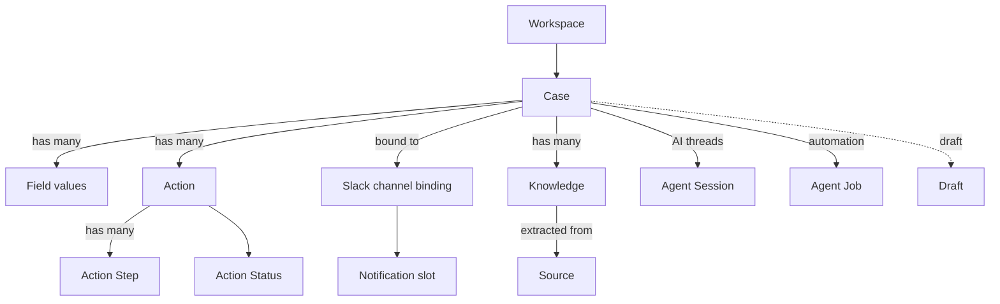

# Core Concepts

This page is the vocabulary of Hecatoncheires. Each term is defined in a few
lines with links to the document that covers it in depth. If you are evaluating
the product, read this first, then jump to
[Getting Started](getting_started.md).

## Relationship overview

## Glossary

### Workspace
The top-level tenant boundary. Every Case, Field definition, Slack binding and
configuration belongs to exactly one Workspace. A single deployment can serve
multiple Workspaces (including Slack Enterprise Grid org-level apps). Defined in
`config.toml`. See [Configuration → Workspace Section](configuration.md#workspace-section).

### Case
The central record — a project, incident, or risk item. A Case moves through
three states: **DRAFT** (work in progress, hidden from the default list), **OPEN**
(active), and **CLOSED** (resolved). Cases carry custom Field values, Actions,
Knowledge, and a bound Slack channel. See the
[User Guide](user_guide.md) for the full lifecycle.

### Field
A customizable attribute on a Case, defined per Workspace in `config.toml`.
Field types include `text`, `number`, `select`, `multi-select`, `user`,
`multi-user`, `date`, and `url`. Select-type fields carry options with optional
metadata (e.g. scores). See [Configuration → Field Definitions](configuration.md#field-definitions).

### Action
A unit of work attached to a Case (e.g. "investigate", "mitigate"). An Action
has an **Action Status** and may contain ordered **Action Steps**. See
[User Guide → Actions and Steps](user_guide.md#actions-and-steps).

### Action Step
A sub-item within an Action, tracked individually and able to emit lifecycle
events (created / updated / completed). See
[User Guide → Actions and Steps](user_guide.md#actions-and-steps).

### Action Status
The workflow state of an Action. Statuses and their display colors are
configured per Workspace under `[[action.status]]`. See
[Configuration → Action Section](configuration.md#action-section).

### Source
An external origin of information (e.g. a Notion page, a GitHub resource, a
Slack message) that the agent tools can read to extract Knowledge. See
[Integrations](integrations.md).

### Knowledge
A piece of information extracted from a Source and associated with a Case. The
AI assist agent and agent tools produce and consume Knowledge.

### Agent Session
A persistent AI conversation tied to a Slack thread on a Case. History and
trace artifacts are stored in Cloud Storage so a session survives across
process instances and turns. User-facing behavior is in the
[User Guide → Chat with the AI](user_guide.md#chat-with-the-ai-in-a-slack-thread);
internals are in [Architecture](develop/architecture.md#agent-thread-session-internals).

### Agent Job
Event-driven or scheduled automation that runs an agent against a Case — for
example, on a lifecycle event or on a cron schedule. Jobs are declared as
`[[job]]` blocks in `config.toml`. The schema lives in
[Configuration → Job Definitions](configuration.md#job-definitions-job);
operating Jobs is covered in [Operations](operations.md#agent-jobs-operations).

### Draft
A Case in the DRAFT state — saved but not yet submitted. Drafts can be created
from a Slack modal or by mentioning the bot, edited on the web Drafts tab, and
submitted or discarded in bulk. See [User Guide → Drafts](user_guide.md#drafts-save--resume).

### Slack channel binding
The link between a Case and a Slack channel. Hecatoncheires can auto-create a
channel per Case (with a configurable prefix) and auto-invite members. See
[Slack Integration](slack.md#automatic-risk-channel-creation).

### Case mode (channel vs thread)
Each Workspace chooses how Cases bind to Slack, via `[slack] mode`:

- **channel** (default): one Case maps to a dedicated Slack channel created at
  case creation. This is the original model — Cases manage Actions and can be
  saved as Drafts.
- **thread**: the Workspace monitors a single channel (`[slack] channel`), and
  **every human top-level message in that channel becomes a Case** bound to its
  thread. Thread replies are recorded on the Case, and mentioning the bot in the
  thread runs an investigation agent that can answer, fill in the Case fields, or
  close the Case. Thread-mode Cases do **not** use Actions or Drafts; instead the
  configurable status set (`[case.status]`) attaches to the Case itself and the
  Kanban board shows Cases. Jobs run identically in both modes.

See [Configuration → Case Section](configuration.md#case-section-thread-mode) and
[Slack Integration](slack.md#thread-mode-monitored-channel).

### Private case
A Case whose bound Slack channel is private. Access is restricted to channel
members; non-members cannot read the Case or its child entities. Enforced in the
usecase layer. See [Configuration → Slack Section](configuration.md#slack-section).

### Notification slot
A channel-side aggregation mechanism that batches related notifications into a
single thread instead of posting each one separately. See
[User Guide → Understanding notifications](user_guide.md#understanding-notifications).

## See Also

- [Getting Started](getting_started.md)
- [User Guide](user_guide.md)
- [Configuration](configuration.md)
