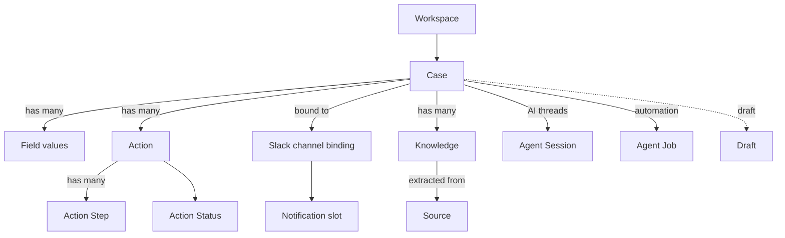

# Core Concepts

This page is the vocabulary of Hecatoncheires. Each term is defined in a few
lines with links to the document that covers it in depth. If you are evaluating
the product, read this first, then jump to
[Getting Started](getting_started.md).

## Relationship overview

## Glossary

### Workspace
The top-level tenant boundary. Every Case, Field definition, Slack binding and
configuration belongs to exactly one Workspace. A single deployment can serve
multiple Workspaces (including Slack Enterprise Grid org-level apps). Defined in
`config.toml`. See [Configuration → Workspace Section](configuration.md#workspace-section).

### Case
The central record — a project, incident, or risk item. A Case moves through
three states: **DRAFT** (work in progress, hidden from the default list), **OPEN**
(active), and **CLOSED** (resolved). Cases carry custom Field values, Actions,
Knowledge, and a bound Slack channel. See the
[User Guide](user_guide.md) for the full lifecycle.

### Field
A customizable attribute on a Case, defined per Workspace in `config.toml`.
Field types include `text`, `markdown` (Markdown text rendered in the Web UI),
`number`, `select`, `multi-select`, `user`, `multi-user`, `date`, `url`, and
`case_ref` / `multi_case_ref`
(references to non-private Cases in another configured workspace). Select-type
fields carry options with optional metadata (e.g. scores). See
[Configuration → Field Definitions](configuration.md#field-definitions).

### Action
A unit of work attached to a Case (e.g. "investigate", "mitigate"). An Action
has an **Action Status** and may contain ordered **Action Steps**. See
[User Guide → Actions and Steps](user_guide.md#actions-and-steps).

### Action Step
A sub-item within an Action, tracked individually and able to emit lifecycle
events (created / updated / completed). See
[User Guide → Actions and Steps](user_guide.md#actions-and-steps).

### Action Status
The workflow state of an Action. Statuses and their display colors are
configured per Workspace under `[[action.status]]`. See
[Configuration → Action Section](configuration.md#action-section).

### Source
An external origin of information (e.g. a Notion page, a GitHub resource, a
Slack message) that the agent tools can read while investigating a Case. See
[Integrations](integrations.md).

### Knowledge
A **workspace-wide shared knowledge entry**: organization-specific information
that does not exist in the LLM's general knowledge (operating rules, internal
proper nouns, past judgements, threat intel, …), captured so it can be reused on
future Case processing. A Knowledge entry has a title, a single Markdown `claim`
body, and one or more free-form `tags`; it is **not** tied to a Case and carries
no custom fields. Both humans (via the WebUI **Knowledge** section) and AI agents
(via the `knowledge__*` tools) read and write it. Entries are retrieved by
semantic search (embedding-based, with a substring fallback) and by tag filter.
See [User Guide → Knowledge](user_guide.md#knowledge).

### Agent Session
A persistent AI conversation tied to a Slack thread on a Case. History and
trace artifacts are stored in Cloud Storage so a session survives across
process instances and turns. User-facing behavior is in the
[User Guide → Chat with the AI](user_guide.md#chat-with-the-ai-in-a-slack-thread);
internals are in [Architecture](develop/architecture.md#agent-thread-session-internals).

### Agent Job
Event-driven or scheduled automation that runs an agent against a Case — for
example, on a lifecycle event or on a cron schedule. Jobs are declared as
`[[job]]` blocks in `config.toml`. The schema lives in
[Configuration → Job Definitions](configuration.md#job-definitions-job);
operating Jobs is covered in [Operations](operations.md#agent-jobs-operations).

### Draft
A Case in the DRAFT state — saved but not yet submitted. Drafts can be created
from a Slack modal or by mentioning the bot, edited on the web Drafts tab, and
submitted or discarded in bulk. See [User Guide → Drafts](user_guide.md#drafts-save--resume).

### Slack channel binding
The link between a Case and a Slack channel. Hecatoncheires can auto-create a
channel per Case (with a configurable prefix) and auto-invite members. See
[Slack Integration](slack.md#automatic-risk-channel-creation).

### Case mode (channel vs thread)
Each Workspace chooses how Cases bind to Slack, via `[slack] mode`:

- **channel** (default): one Case maps to a dedicated Slack channel created at
  case creation. This is the original model — Cases manage Actions and can be
  saved as Drafts.
- **thread**: the Workspace monitors a single channel (`[slack] channel`), and
  **every human top-level message in that channel becomes a Case** bound to its
  thread. Thread replies are recorded on the Case, and mentioning the bot in the
  thread runs an investigation agent that can answer, fill in the Case fields, or
  close the Case. Thread-mode Cases do **not** use Actions or Drafts; instead the
  configurable status set (`[case.status]`) attaches to the Case itself and the
  Kanban board shows Cases. Because thread-mode Workspaces manage no Actions,
  **agent execution there is given no Action tools** — neither the investigation
  agent nor Jobs can read or mutate Actions, and the Job system prompt omits the
  Actions section. To compensate, a thread-mode Job's system prompt instead
  embeds the thread's recent Slack messages — up to the newest 32 from the last
  24 hours, oldest first — so the Job agent can reason about the latest
  conversation; long messages are truncated (~140 characters, with the original
  character count noted). Jobs otherwise run in both modes and can still edit
  Case fields and status, post to Slack, and use memos.

  A thread-mode Workspace **never creates a dedicated channel**, regardless of
  how creation is triggered. Besides the monitored channel's own messages,
  Cases can also be created from the Web UI, a slash command, or a bot mention;
  in a thread-mode Workspace all of these post a new root message into the
  monitored channel and bind the Case to that thread (the created Case's summary
  replaces the root), rather than provisioning a per-Case channel. Only the
  Case's title, description, and custom fields carry over from those entry
  points; the assignees and test flag they may offer do not apply to thread-mode
  Cases (the private flag is a channel-mode-only concept — see "Private case").

See [Configuration → Case Section](configuration.md#case-section-thread-mode) and
[Slack Integration](slack.md#thread-mode-monitored-channel).

### Workspace channel
A **channel-mode**, workspace-level Slack channel that is *not* bound to any
single Case (in contrast to the per-Case dedicated channels). Optional, one per
Workspace, configured via `[slack] workspace_channel`. It is where the
[Workspace agent](#workspace-agent) runs, and the intended home for future
workspace-wide notifications. See
[Configuration → Workspace channel & agent](configuration.md#workspace-channel--agent-channel-mode).

### Workspace agent
The cross-case agent that runs in the [Workspace channel](#workspace-channel).
When @mentioned, its thread becomes one session and it can read across, and act
on, **every Case the mentioning user can access** — answering questions, creating
Cases, or adding Actions to the right existing Case. It acts with the mentioning
user's permissions (private Cases stay invisible to non-members) and is held to a
strict write guardrail: it changes nothing unless the request explicitly asks
for that change. Configured via `[slack.workspace_agent]` (`prompt` /
`prompt_file`). See
[Configuration → Workspace channel & agent](configuration.md#workspace-channel--agent-channel-mode).

### Private case
A Case whose bound Slack channel is private. Access is restricted to channel
members; non-members cannot read the Case or its child entities. Enforced in the
usecase layer. See [Configuration → Slack Section](configuration.md#slack-section).

Private is a **channel-mode-only** feature: its sole effect is a dedicated
private Slack channel, which thread-mode Cases (bound to the shared monitored
channel) have no equivalent for. The web form therefore hides the **Private
case** checkbox in thread-mode Workspaces, and the create flow rejects a private
Case there regardless of entry point (web, Slack modal, agent tool, import).

### Notification slot
A channel-side aggregation mechanism that batches related notifications into a
single thread instead of posting each one separately. See
[User Guide → Understanding notifications](user_guide.md#understanding-notifications).

## See Also

- [Getting Started](getting_started.md)
- [User Guide](user_guide.md)
- [Configuration](configuration.md)
