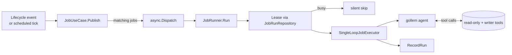

# Operations Guide

This guide collects the day-2 runbook material for operating Hecatoncheires:
observability and error reporting, agent Job operations, scheduled-sweep
wiring, data migrations, the one-shot diagnosis jobs, and backup guidance for
the Firestore and Cloud Storage state.

The commands themselves (flags, env vars) are documented in the
[CLI Reference](./cli.md); this guide focuses on the operational use of those
commands. Declarative configuration (workspace TOML, the `[[job]]` schema,
system prompt) lives in the [Configuration Guide](./configuration.md).

## Observability (Sentry)

The server can forward errors to [Sentry](https://sentry.io/) in addition to
the structured log. Sentry is opt-in: leaving `HECATONCHEIRES_SENTRY_DSN`
empty keeps the SDK uninitialized and the integration becomes a cheap no-op
(one atomic flag check per error).

### Environment variables

| Env Var | Default | Description |
|---------|---------|-------------|
| `HECATONCHEIRES_SENTRY_DSN` | - | Sentry DSN. **Setting this enables Sentry.** |
| `HECATONCHEIRES_SENTRY_ENV` | - | Environment tag (`production`, `staging`, etc.) |
| `HECATONCHEIRES_SENTRY_RELEASE` | - | Release identifier — set to the commit SHA in CI |

### What gets reported

Every call to `errutil.Handle` (and the HTTP variant) feeds the error to
Sentry's `CaptureException`. `goerr` values attached to the error appear as
the **`goerr_values`** Sentry context, so structured fields such as
`slack_error`, `query`, or `case_id` show up alongside the exception
without per-call site changes.

For HTTP requests, Sentry middleware sits right after `RequestID` so
captures inside a handler automatically carry the request URL, method, and
headers. Panics propagate through the middleware (`Repanic: true`) so chi's
`Recoverer` still produces a `500` response after Sentry has captured the
event.

### Operational troubleshoot

- **Slack `missing_scope` even after adding the scope**: re-install the
  Slack App to the workspace. Adding scopes in the App Manifest does not
  re-issue existing tokens; the `xoxp-...` you had before the change still
  carries the old scope set. Re-install (Install App → Reinstall to
  Workspace) and replace the token in `HECATONCHEIRES_SLACK_USER_OAUTH_TOKEN`.
  See the [Slack Integration Guide](./slack.md) for the full re-install flow.
- **Confirming what scope Slack actually wants**: when a Slack call fails,
  the wrapped error carries the `slack_error` / `slack_response_messages` /
  `slack_response_warnings` fields. Both the structured log and the Sentry
  `goerr_values` context include these — search for them to find the
  Slack-side error code without parsing free-form error strings.

## Agent Jobs operations

Agent Jobs run LLM-powered automation against Case lifecycle events and
periodic ticks. The declarative definition — the `[[job]]` TOML schema,
execution strategy, system prompt, per-case customisation, and the tool
palette — is documented in the [Configuration Guide](./configuration.md).
This chapter covers the operator-facing runtime behaviour: triggers,
concurrency, failure handling, the run-log event trail, and scheduling.

### When a Job runs

Two event domains can trigger a Job:

| Domain      | When it fires |
|-------------|---------------|
| `case`      | Case lifecycle transitions (`created`, `closed`). Fired by `CaseUseCase` immediately after persistence. |
| `scheduled` | A duration (`every`) or cron expression (`cron`) elapsed since the last successful run. Fired by the `hecatoncheires tick` CLI or the `POST /hooks/tick` endpoint. |

A Job may subscribe to multiple domains; the runtime fires one
invocation per matching `(job, case)` tuple. The full subscription syntax
(`events.case` / `events.scheduled`) is documented with the
[`[[job]]` schema](./configuration.md).

### Tools available to a Job

The exact tool palette a Job gets — and how it differs from the interactive
mention agent — is documented once, in
**[Agent Tools → Tools available by context](agent_tools.md#tools-available-by-context)**.
The short version, because it surprises people:

- A Job gets **case edits** (`case__update_case`, `case__assign` /
  `case__unassign`, and `case__update_case_status` where a case status set
  exists), **action management** in channel-mode workspaces, **workspace
  knowledge**, **memos** (when enabled), **web fetch**, and a single
  channel-pinned Slack poster (`slack__post_to_case_channel`).
- A Job does **NOT** get the Slack *search* tools, Notion, or GitHub. Those are
  wired only into the interactive / investigation contexts. A Job that needs
  external context must already have it in the case — it cannot fetch it live.

Writer mutations run as `model.SystemActorID` (`"@system"`). The
`CaseUseCase.UpdateCase` path skips Slack user-token permission checks
when the actor is the system identifier.

### Lifecycle of an invocation



#### Concurrency

The `JobRunRepository` provides a per-(workspace, case, job) lease. A
second invocation that arrives while the first holds the lease is
**silently skipped** — duplicate triggers from rapid lifecycle toggles
or two scheduler ticks landing close together are absorbed safely.

The default lease is 10 minutes. `RecordRun` clears the lease on
completion; if the runner crashes the lease times out on its own.

#### Loop suppression

Mutations a Job's tool performs run with a context-marker carrying the
originating job id (`job.JobActorMarker`). `JobUseCase.Publish` skips
only the job whose id matches that marker, so a Job that touches
`case__update_case` cannot re-fire itself — but any *other* Job
listening on the resulting lifecycle event still fires. This is what
lets an on-created Job that closes the case trigger the on-closed Job.

Note that per-JobID suppression does **not** make cross-Job loops
structurally impossible. In thread mode a case can be reopened and
re-closed via the status tool, so `closed` is not a one-way edge; two
Jobs that both listen on the same lifecycle and whose agents reopen and
re-close the case could ping-pong indefinitely. Loop-freedom relies on
agents not performing such reopen cycles — typical read-and-post Jobs
(summarisers, notifiers) do not — rather than on the trigger graph's
topology. If a future Job configuration genuinely needs to reopen cases,
add a topology-independent safety valve (per-(case, lifecycle) dispatch
cap or depth guard) before relying on it.

### Running scheduled Jobs

There are two entry points for the time-driven sweep. Both end in the
same `ScheduledScanner.Scan` call.

#### CLI: one-shot sweep

```sh
$ hecatoncheires tick --config /etc/hecatoncheires/workspaces/
```

Suitable for `cron`, GitHub Actions, or any external timer. The command
exits when the sweep and every dispatched Job goroutine finish.

#### HTTP: `POST /hooks/tick`

Available on the `hecatoncheires serve` HTTP server. Wire to Cloud
Scheduler / Eventarc / your preferred scheduler. The endpoint:

- Is **unauthenticated by design.** Deploy behind IAP / Cloud Run
  internal-only ingress / private networking. Do NOT expose to the
  public internet.
- Responds `200` immediately; the sweep runs in a background goroutine.
- Ignores the request body.

### Failure handling

- Job validation errors (TOML schema, unknown lifecycle value, bad cron):
  loud failure at config load — startup aborts.
- LLM errors / tool errors during a run: recorded via `errutil.Handle`
  (Sentry-bound) and persisted to `JobRunRepository` as `FAILED`. A
  matching `RUN_ERROR` entry is appended to the per-Run event log (see
  next section).
- Workspace / case loading failures inside the runner: recorded as
  `FAILED` on the JobRun lock doc; the lease is released so a retry can
  pick up. No `JobRunLog` is written for these *prepare-stage* failures
  because no RunID has been allocated yet.

### Run logs and event trail

Each invocation of a Job (= one *Run*) writes a structured log so the
agent's behaviour can be reconstructed after the fact. The log is
designed for rough flow tracing — "what was asked, what did the model
say, which tools were called with what arguments" — not exact byte-for-
byte reproduction.

#### Web UI: per-Run detail page

Each Run has a detail page in the web console at
`/ws/{WorkspaceID}/cases/{CaseID}/agent/runs/{RunID}`, rendering the
metadata, system prompt, and the full event timeline. The page header
carries a **Download JSON** button that exports the entire record —
the `JobRunLog` metadata plus every `JobRunEvent` (in `Sequence` order,
with each `payload` decoded to nested JSON) — as a single
`jobrun-{CaseID}-{RunID}.json` file. The export runs entirely in the
browser from data already fetched for the page (no extra API call) and
mirrors the field names / shapes described below.

#### Identifiers

| ID | Scope | Generated by | Where it appears |
|----|-------|-------------|------------------|
| `RunID`   | One Run | `JobRunner.Run` (UUIDv7) | Doc ID of the `JobRunLog`; flat field on every `JobRunEvent`. |
| `TraceID` | One gollem trace | `JobRunner.Run` (UUIDv7) | Field on `JobRunLog` and every `JobRunEvent`. Logically distinct from `RunID` so a future plan-execute runtime can group multiple sub-agent traces under one Run. |

Both IDs are also mirrored onto the `JobRun` lock doc as `LastRunID` /
`LastTraceID` so a single read of the lock doc points at the latest log
without scanning the subcollection.

#### Firestore layout

```
workspaces/{WorkspaceID}/cases/{CaseID}/jobRuns/{JobID}                     ← lock doc + last-run summary
workspaces/{WorkspaceID}/cases/{CaseID}/jobRuns/{JobID}/logs/{RunID}        ← JobRunLog (one per Run)
workspaces/{WorkspaceID}/cases/{CaseID}/jobRuns/{JobID}/logs/{RunID}/events/{Sequence}
                                                                            ← JobRunEvent (one per LLM call or tool call)
```

`Sequence` is a 20-digit zero-padded `uint64` so doc IDs sort
lexicographically the same way they sort numerically.

#### `JobRunLog` fields (per Run)

- Identifiers: `WorkspaceID`, `CaseID`, `JobID`, `RunID`, `TraceID`
  (all top-level scalars, BigQuery-friendly).
- Lifecycle: `Stage` (`RUNNING` / `SUCCESS` / `FAILED`), `StartedAt`,
  `EndedAt`, `Error`.
- Runtime: `ExecutorKind` (`"single_loop"` for `simple`, `"plan_execute"`
  for `planexec`), `ExecutorVersion`.
- Provenance: `EventType` (e.g. `case`, `scheduled`), `EventTriggerAt`.
- `SystemPrompt`: the full system prompt, truncated from the tail at
  ~800 KiB. Held once per Run rather than duplicated on every LLM call.

#### `JobRunEvent` kinds

Each event is one of:

| Kind            | When it appears |
|-----------------|-----------------|
| `LLM_REQUEST`   | Emitted at every LLM API call. Captures `Model`, the full message history sent, and the advertised tool list. |
| `LLM_RESPONSE`  | Paired with `LLM_REQUEST`. Captures `Texts`, `FunctionCalls`, `InputTokens`, `OutputTokens`, `DurationMs`. |
| `TOOL_CALL`     | One per tool execution. `ParentSequence` points at the LLM_RESPONSE whose tool_use spawned it. Captures `ToolName`, `ArgumentsJSON`, `ResultJSON`, `IsError`, `ErrorMessage`, `StartedAt`, `EndedAt`. |
| `RUN_ERROR`     | Emitted by `JobRunner.Run` when the agent loop fails. Captures `Stage` (`prepare` / `execute` / `finish`) and `Message`. |

#### Truncation policy

Single text or JSON fields longer than `model.MaxInlineBytes` (800 KiB)
are silently truncated from the tail. There is no truncation flag — the
goal is "you can read what happened roughly", not exact reproduction.
If you need full fidelity for a particular Job, consider a custom trace
backend; the public `trace.Handler` interface is `gollem.WithTrace`-able
from any executor.

#### Strategy coverage

Both Job strategies populate the event timeline:

- `simple` (single-loop) records the one gollem agent's `LLM_REQUEST` /
  `LLM_RESPONSE` / `TOOL_CALL` events.
- `planexec` records events from **every** agent the run drives — the
  planner rounds, each parallel investigation sub-agent, the round-1
  direct reply (when taken), and the final-response synthesis — so a
  multi-step investigation shows its whole trail, not just a summary.
  (The Job's per-event handler is wired into all of them alongside the
  separate trace archive recorder; before this was wired, `planexec`
  Jobs showed an empty timeline despite succeeding.)

Two fields on every `JobRunEvent` carry attribution but are currently
coarse:

- `Phase` — always `"execute"` (or `"reflection"` for the optional
  post-run reflection pass). The finer `"plan"` / `"investigate"` /
  `"final"` labelling for `planexec` is not emitted yet.
- `AgentLabel` — always `""`. `planexec` sub-agents are independent
  root agents (not gollem-internal sub-agents), so the per-agent label
  hook does not fire; events are ordered by `Sequence` but not attributed
  to a named sub-agent.

Because `planexec` sub-agents run in parallel (up to the plan's per-phase
fan-out), a `TOOL_CALL`'s `ParentSequence` is best-effort under
concurrency — it points at the most recent `LLM_RESPONSE` the shared
handler observed, which may belong to a sibling sub-agent. The timeline
remains complete and `Sequence`-ordered; only the parent linkage and
per-agent attribution are approximate. `simple` Jobs are single-threaded
and therefore exact.

Combined with `JobRunLog.ExecutorKind`, downstream consumers can filter
by runtime without a Firestore schema change.

#### BigQuery export

The Firestore documents use Go field names directly (no `firestore:`
struct tags), so a Datastream / `gcloud firestore export` to BigQuery
produces tables with PascalCase columns: `SELECT * FROM events WHERE
WorkspaceID = 'X' AND CaseID = 42`, or `events JOIN logs USING (RunID)`.
Every record carries `WorkspaceID`, `CaseID`, `JobID`, `RunID`,
`TraceID` at the top level, so JOIN-friendly queries are flat.

### Operational tips

- Treat the `prompt` as the only place to encode Job-specific behaviour;
  everything else is fixed by the runtime.
- For high-frequency scheduled Jobs, set `every` to a value greater than
  your expected sweep cadence so the duration-since-last-run check absorbs
  scheduler jitter.
- Use the `JobRunRepository.List` API (over `workspaceID`) to surface
  per-Job state in an observability dashboard.

## `tick` scheduling

Scheduled Jobs are time-driven by an external sweep — Hecatoncheires does
not run its own internal cron. You must wire one of the two entry points
described in [Running scheduled Jobs](#running-scheduled-jobs) to a
scheduler:

- **`hecatoncheires tick`** — a one-shot CLI sweep. Run it from `cron`,
  GitHub Actions, a Kubernetes CronJob, or any external timer. The process
  exits once the sweep and every dispatched Job goroutine finish, so it is
  safe to invoke on a fixed interval. Flags are documented in the
  [CLI Reference](./cli.md).
- **`POST /hooks/tick`** — the HTTP entry point on the `serve` server, for
  push-style schedulers (Cloud Scheduler / Eventarc). It is
  **unauthenticated by design** — deploy it behind IAP, Cloud Run
  internal-only ingress, or private networking, and never expose it to the
  public internet. It responds `200` immediately and runs the sweep in a
  background goroutine.

Set each Job's `every` interval larger than your sweep cadence so the
duration-since-last-run check absorbs scheduler jitter. Overlapping ticks
are safe: the per-(workspace, case, job) lease silently skips a second
invocation that arrives while the first still holds the lease (see
[Concurrency](#concurrency)).

## `migrate` operations

The `migrate` command (alias: `m`) manages Firestore indexes. It targets a
Firestore project / database via `--firestore-project-id` and
`--firestore-database-id`; the full flag reference is in the
[CLI Reference](./cli.md).

Run `migrate` with `--dry-run` first to preview the migration changes
without applying them, then re-run without the flag to apply. Note the
project's standing policy that **Firestore index changes are avoided in
principle** — most features are designed to work against the existing
indexes, so a `migrate` run that wants to add an index should be reviewed
with the team before it is applied in production.

## `diagnosis` usage

The `diagnosis` command groups one-shot data inspection / repair jobs. Each
sub-subcommand is a self-contained job; the umbrella itself takes no flags.
The flag reference for each job is in the [CLI Reference](./cli.md).

### `diagnosis fix-unsent-action`

Re-posts Slack messages for Actions whose initial Slack post never reached
Slack. The job sweeps every workspace in the registry, finds Actions with an
empty `SlackMessageTS`, and replays the post via the unified
`ActionUseCase.PostSlackMessageToAction` entry point. Repeat runs are safe:
already-posted Actions are skipped.

The job logs a final summary line:

```
fix-unsent-action complete total=N fixed=X skipped=Y failed=Z
```

- `Total` — Actions found with an empty `SlackMessageTS`
- `Fixed` — Successfully posted; timestamp persisted
- `Skipped` — Documented skip conditions (parent Case has no Slack channel,
  the Action was already posted by a concurrent run, or the row was deleted
  during the sweep)
- `Failed` — Unexpected errors. Each is reported via `errutil.Handle` so it
  reaches the configured error sink (Sentry / log); the sweep continues
  past failures so a single bad row never blocks the rest

## Backup & data migration

Hecatoncheires keeps persistent state in two backends, and a backup plan
should cover both:

- **Firestore** — the system of record for domain data: Cases, Actions,
  action steps, Knowledge, Slack message linkage, agent Session metadata,
  and the agent Job run logs. Job run logs live under
  `workspaces/{WorkspaceID}/cases/{CaseID}/jobRuns/{JobID}/...` (see
  [Firestore layout](#firestore-layout)); agent Session metadata is keyed
  by Slack channel + thread TS under `slack_channels/{channelID}/sessions/{threadTS}`.
  Use `gcloud firestore export` for backups; the same export feeds the
  BigQuery analytics path described in [BigQuery export](#bigquery-export).
- **Cloud Storage** — the agent conversation History and execution Trace
  blobs (one per session / per turn), written by the Slack-mention agent.
  Object layout under the configured bucket:

  ```
  {prefix}/v1/sessions/{sessionID}/history.json
  {prefix}/v1/traces/{sessionID}/{traceID}.json
  ```

  The bucket and optional prefix are set via
  `HECATONCHEIRES_CLOUD_STORAGE_BUCKET` /
  `HECATONCHEIRES_CLOUD_STORAGE_PREFIX`. The service account needs
  **Storage Object Admin** on the bucket — `Storage Object Viewer` alone
  is insufficient because every LLM turn mutates objects. Back the bucket
  up with object versioning or a scheduled bucket copy.

For the full Cloud Storage object model, History/Trace formats, and the IAM
details, see [agent session implementation in the Architecture Guide](./develop/architecture.md)
and the [User Guide](./user_guide.md) for the user-facing session behaviour.
No new Firestore composite indexes are required for these lookups; they are
direct document fetches.

## See Also

- [CLI Reference](./cli.md) — flags and env vars for `serve`, `tick`, `migrate`, and `diagnosis`
- [Configuration Guide](./configuration.md) — workspace TOML and the `[[job]]` schema, system prompt, and per-case agent settings
- [Architecture Guide](./develop/architecture.md) — agent session internals, Cloud Storage object model, and dataloader design
