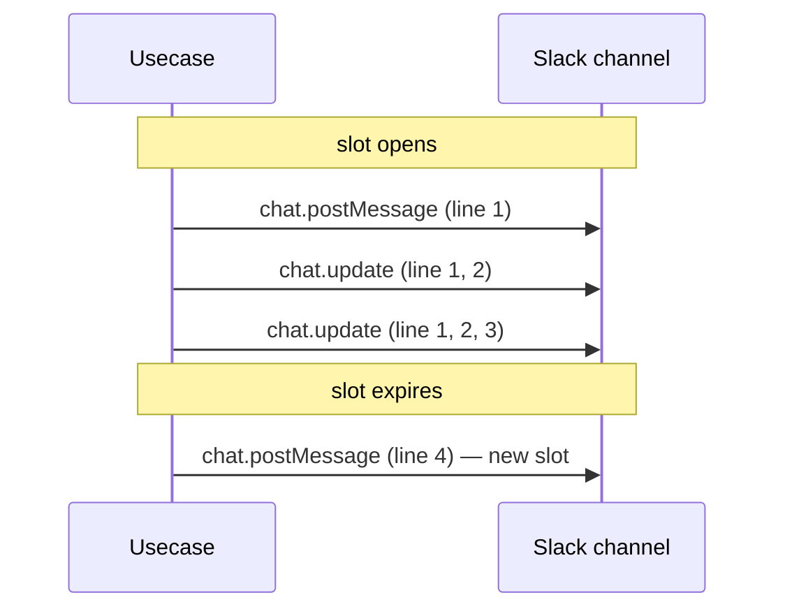

# Slack notifications

Hecatoncheires posts Slack messages when Action / ActionStep entities
change. The notifications are split across two surfaces so that the
parent Slack channel stays readable while keeping a full audit log in
the thread.

## Surfaces

| Surface | Purpose | Behaviour |
|---|---|---|
| **Thread** | Per-event audit log. Always one Slack message per change. | Every Action / ActionStep change posts a new context block as a thread reply on the Action card. Never collapsed, never updated. |
| **Channel** | High-signal visibility into recent change activity. | A single editable "channel message" aggregates the latest changes within a rolling slot window. |

## Notification slot (channel-side aggregation)

A **notification slot** is a per-Slack-channel rolling aggregation
window. The first qualifying change posts a new channel message and
opens the slot; subsequent changes within the slot edit the existing
message in place via `chat.update`. Once the slot expires, the next
event posts a fresh channel message and replaces the slot.

Inside the slot message, events are grouped by Action and each group
is rendered as its own Block Kit **context block** (compact / lightly
de-emphasised text). The context block's mrkdwn carries the Action
title as a `<URL|label>` Slack permalink at the top, followed by the
change lines for that Action. Wrapping the title in `<URL|...>` keeps
the message free of preview cards, and the initial `chat.postMessage`
is additionally sent with `unfurl_links=false` / `unfurl_media=false`
for belt-and-braces.

The fallback `text` field on `chat.postMessage` / `chat.update` is
intentionally **empty**: Slack would otherwise render it as a duplicate
body alongside the Block Kit content. The context blocks themselves
carry everything readers / notification clients need.

Per-event UTC times are intentionally NOT prefixed on each row —
readers across multiple timezones would otherwise see a misleading
absolute clock. Slack's own message-level timestamp on the channel
message communicates "when this update happened" without ambiguity.

### What gets aggregated

Only events listed in `pkg/usecase/action_broadcast.go`'s
`broadcastableActionEvents` set surface on the channel. Everything else
stays inside the thread regardless of slot configuration. The current
set (subject to change in code) includes status changes, assignee
changes, and step-related events.

### What gets posted as a thread reply

Every qualifying event still posts a thread reply with the same body
text — the thread is the authoritative audit log. When slot
aggregation is enabled, the thread reply omits
`reply_broadcast` (no "Also sent to #channel" surface) since the
channel side is already handled by the slot.

When slot aggregation is **disabled** (slot duration set to `0`), the
thread reply switches back to `reply_broadcast` and posts to the
channel per event — the legacy behaviour.

## Configuration

| Flag / env | Default | Effect |
|---|---|---|
| `--slack-notification-slot-duration` / `HECATONCHEIRES_NOTIFICATION_SLOT_DURATION` | `1h` | Rolling slot length. The first event opens a slot lasting this long; subsequent events within the window edit the same channel message. |
| `… = 0` | — | Disables aggregation entirely. Each qualifying event posts to the thread with `reply_broadcast`, replicating the legacy fan-out behaviour. |

The duration accepts any Go `time.Duration` string (`30m`, `2h`,
`90s`).

## Operational notes

- **Slot state is persisted in Firestore** at
  `slack_channels/{channelID}/notification_slots/current`. The
  application is stateless across instances — slot continuity survives
  rolling restarts and horizontal scale.
- **Multi-instance safety**: there is no leader election. Two
  instances racing on the same channel can — in the worst case —
  produce two aggregate messages within a single slot window. Thread
  audit logs are never affected.
- **No reaper job**: expired slots are never proactively cleaned up.
  The next qualifying event reactively rolls the slot over, so an
  unused slot simply lingers as a stale doc until the next change.
- **`chat.update` failure** is treated as non-fatal: the slot is
  dropped (the next event starts a fresh channel message) and the
  error flows through `errutil.Handle` (Sentry / logs). The thread
  reply has already succeeded by this point, so the audit trail is
  intact.
- **Slot length is global**: there is no per-workspace or per-channel
  override.

## Disabling aggregation

Set `HECATONCHEIRES_NOTIFICATION_SLOT_DURATION=0` (or
`--slack-notification-slot-duration=0`) on the `serve` command.
Channel-side notifications then fall back to the legacy
`reply_broadcast` per-event path with no further changes required.
