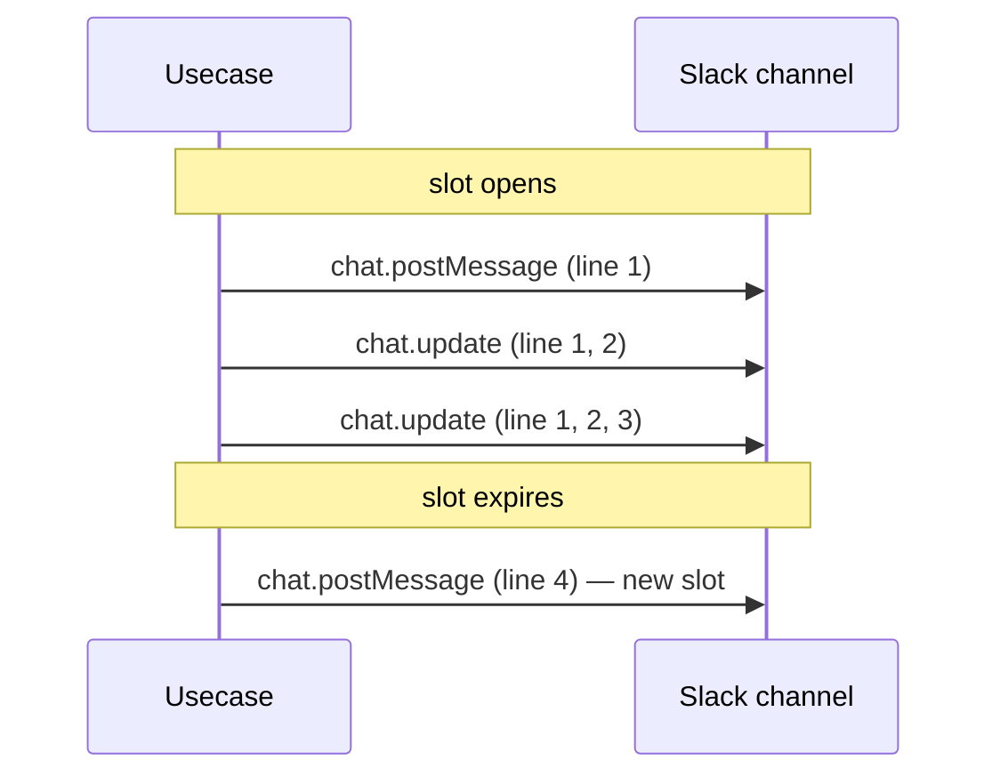

# User Guide

This guide walks through everything a Slack user can do with Hecatoncheires, end to end: creating Cases from a slash command, saving and resuming Drafts, asking the bot to draft a Case by mentioning it, tracking work with Actions and Steps, chatting with the AI in a thread, the automation that fires on the Case lifecycle, how notifications work, and bulk-importing Cases from YAML. Setup and configuration details live in [slack.md](slack.md), [configuration.md](configuration.md), and [operations.md](operations.md); this guide focuses on what you do and what you see.

## Creating a Case in Slack (Slash → modal)

Slack slash commands let users create and edit cases directly from Slack without opening the web UI. The slash command behaves differently depending on the channel context:

- **In a case channel**: Opens an edit modal with the current case values prefilled
- **In any other channel**: Opens a case creation modal

For the one-time Slack app setup (registering the slash command, enabling interactivity, scopes), see [slack.md](slack.md).

### How It Works

#### Case Creation (non-case channels)

1. User types a slash command (e.g., `/create-case`) in a regular Slack channel
2. Slack sends a request to Hecatoncheires
3. A Block Kit modal opens with the case creation form
4. User fills in the form and submits
5. A new case is created and a confirmation message is posted to the channel

#### Case Editing (case channels)

1. User types the slash command inside a case's dedicated Slack channel
2. Hecatoncheires detects that the channel is linked to an existing case
3. A Block Kit modal opens with all current values prefilled (title, description, and custom fields)
4. User modifies the values and submits
5. The case is updated and a confirmation message is posted to the channel

**Notes:**
- Private case access control is enforced: non-members of a private case channel receive an ephemeral error message
- Assignees are preserved during edit (they are managed separately in the web UI)
- If the title is changed, the Slack channel is automatically renamed to match

#### Workspace Selection

The behavior depends on how many workspaces are configured and whether a workspace ID is specified in the URL:

- **Workspace ID in URL** (e.g., `/hooks/slack/command/risk`): Opens the case creation modal directly for that workspace (unless the channel already has a linked case)
- **Single workspace configured**: Opens the case creation modal automatically
- **Multiple workspaces configured**: Shows a workspace selection modal first, then the case creation modal

### Custom Fields in Modal

The case creation modal dynamically includes input fields based on the workspace's field configuration (defined in TOML config). Supported field types:

| Field Type | Modal Input |
|------------|------------|
| `text` | Plain text input |
| `number` | Number input |
| `select` | Single-select dropdown |
| `multi_select` | Multi-select dropdown |
| `user` | Slack user selector |
| `multi_user` | Multi-user selector |
| `date` | Date picker |
| `url` | URL text input |

## Drafts (save & resume)

Hecatoncheires lets users save a half-written case from the Slack
`/cmd` creation modal and come back to it later from the web. The
saved entry — a **Case Draft** — has its own pre-assigned case number,
its own author-scoped listing, and a single-click "Submit" path that
promotes it to a regular OPEN case.

### Lifecycle

Cases follow a simple linear lifecycle:

```
                        SubmitDraft
                            │
              ┌── DRAFT ────┴────▶ OPEN ◀──┬── reopen ── CLOSED
              │                            │
              └── DiscardDraft (delete)    └── closeCase
```

* `DRAFT` — saved from Slack; visible only to the reporter, hidden
  from the default `cases` listing, no Slack channel binding, no
  notifications.
* `OPEN` — submitted; behaves exactly like a case created directly
  via the modal's Submit button (channel created, invites posted,
  bookmark added, welcome message rendered).
* `CLOSED` — closed via `closeCase`; can be re-opened via
  `reopenCase`. `closeCase` / `reopenCase` reject `DRAFT` cases.

### Slack: Save as Draft

The `/cmd` creation modal exposes a **Draft mode** checkbox inside
the **Options** group, next to the existing **Private case** checkbox.
When the user ticks **Draft mode** and presses the modal's footer
**Create** button:

1. Slack delivers the view_submission to `HandleCaseCreationSubmit`.
2. The handler detects the `draft` option in the Options checkbox
   group and routes the request through
   `CaseUseCase.CreateDraft` instead of `CaseUseCase.CreateCase`.
3. The case is persisted with `status: DRAFT`, reporter set to the
   submitting Slack user, and no Slack channel is created.
4. An ephemeral message is posted in the originating channel
   pointing to the web Drafts page (`/ws/{wsId}/drafts`).
5. Slack auto-closes the modal as usual for view_submission.

Choosing not to tick **Draft mode** runs the standard `CreateCase`
path (channel created, invites posted, bookmark added, welcome
message rendered). The two flags are independent: ticking both
**Private case** and **Draft mode** yields a private draft.

No new slash command is added, and there is no longer a separate
**Save as draft** button in the modal body — the legacy block_actions
handler (`HandleSaveAsDraftClick`) is kept for backward compatibility
with any in-flight callbacks emitted before the layout change but is
no longer surfaced through the modal.

### Web: Drafts page

Logged-in users see a **Drafts** entry in the workspace sidebar that
links to `/ws/{wsId}/drafts`. The list shows the user's own drafts
(reporter scope is enforced server-side; another user's drafts are
not surfaced through any listing or single-case fetch).

Each row links to `/ws/{wsId}/drafts/{id}` — a read-only detail view
that shows the saved title, description, privacy flag, and any
workspace-custom field values entered before saving. The detail view
exposes two actions:

* **Submit** — promotes the draft to OPEN by calling
  `submitDraft(workspaceId, id)`. Submit requires a non-empty title.
  After a successful submit, the user is taken to the regular case
  detail page (`/ws/{wsId}/cases/{id}`).
* **Discard** — permanently deletes the draft via
  `discardDraft(workspaceId, id)`. Only the reporter can discard.

Draft *editing* is intentionally out of scope for the initial
release: users who want to revise the draft re-open the Slack modal
to start fresh, or pick up the saved entry as-is and add details
after Submit.

### Web: Bulk actions on the Drafts tab

When more than a handful of drafts pile up — common after a busy
Slack day, or when the YAML importer parks half-finished entries
for review — single-row Submit / Discard becomes the bottleneck. The
Drafts tab on the Case list adds a checkbox column and a floating
action bar to bulk-process them.

#### UI affordances

* A checkbox in the table header offers a tri-state select-all over
  every accessible draft in the current filter (across pages of the
  same workspace).
* Per-row checkboxes live in the new left-most column. The
  `accessDenied` rows that block private drafts of other users keep
  their checkbox disabled.
* Once one or more rows are selected the **BulkSelectionBar** docks
  above the table with three actions:
  * **Submit selected** — runs `submitDraft` on each selection.
    Success removes the row (DRAFT → OPEN); failure leaves the
    draft in place with the failure cause surfaced in the result
    dialog.
  * **Delete selected** — opens a **BulkDeleteConfirmDialog** with
    a count, body, and a preview of up to five draft titles. Only
    after the user confirms does it run `discardDraft` per row.
  * **Clear selection** — drops the selection without acting.

The bar is hidden when no rows are selected. The Open and Closed
tabs do not show the checkbox column at all — bulk actions are
draft-only.

#### Result dialog

After every bulk run the **BulkResultDialog** opens with two
sections:

* **Succeeded (N)** — IDs and titles that completed.
* **Failed (N)** — IDs and titles paired with the human-readable
  reasons. The dialog matches one i18n string per error code, so
  CJK users see the same surface their UI normally provides.

Successful drafts are dropped from the on-screen selection so the
user can re-act on failures without re-checking; the table is
refetched immediately after the dialog opens so DRAFT → OPEN
promotions disappear from the list naturally.

#### Error codes on `submitDraft` / `discardDraft`

The GraphQL resolvers tag each error in the response's
`extensions.code` field. The frontend's bulk hook
(`useBulkDraftAction`) branches on the code to render an
appropriate message; new codes added on the Go side
(`pkg/controller/graphql/errors.go` constants) MUST also be added
to the TypeScript `DRAFT_ERROR_CODE` table in
`frontend/src/graphql/draftErrorCodes.ts` so the discriminated
union stays in sync.

| extensions.code             | Trigger                                              | extra extension fields    |
|-----------------------------|------------------------------------------------------|---------------------------|
| `MISSING_REQUIRED_FIELDS`   | `SubmitDraft` rejected: required custom fields blank | `missingFieldNames`       |
| `TITLE_REQUIRED`            | `SubmitDraft` rejected: title is empty               | —                         |
| `INVALID_STATUS_TRANSITION` | Race: draft already promoted by another tab          | `currentStatus`           |
| `FIELD_VALIDATION_FAILED`   | Field-level validator (option ID, type)              | —                         |
| `FORBIDDEN`                 | Private draft from another reporter                  | —                         |
| `NOT_FOUND`                 | Draft was discarded between fetch and submit         | —                         |
| `ACTIVATION_FAILED`         | Slack channel creation / invites failed; draft rolled back | —                   |

The HTTP middleware maps the client-fault codes to 4xx and leaves
server-fault codes (e.g. `ACTIVATION_FAILED`) on 500 so they continue
to page when something genuine is wrong.

### GraphQL surface

```graphql
# DRAFT is excluded from cases() unless explicitly requested.
enum CaseStatus { DRAFT OPEN CLOSED }

extend type Query {
  # Author-scoped: returns only the auth-context user's own drafts.
  drafts(workspaceId: String!): [Case!]!
}

extend type Mutation {
  # Promotes a draft to OPEN and triggers Slack channel creation etc.
  submitDraft(workspaceId: String!, id: Int!): Case!
  # Permanently deletes the caller's own draft.
  discardDraft(workspaceId: String!, id: Int!): Boolean!
}
```

The general `cases(workspaceId, status)` listing **excludes** DRAFT
by default. Passing `status: DRAFT` works but is enforced
author-scoped at the resolver — strangers see an empty list.

### Access control

* Only the case's reporter (the Slack user who clicked Save as Draft)
  can see, submit, or discard a draft.
* Drafts skip private-case channel membership checks because there
  is no Slack channel until Submit — the reporter check is
  sufficient.
* `closeCase` and `reopenCase` refuse to operate on DRAFT cases and
  return `ErrCaseIsDraft`. Drafts must Submit first (or be
  discarded).

## Create a draft by mentioning the bot

When a user mentions the Hecatoncheires bot (`@hecatoncheires`) in a Slack
channel that is **not** already bound to an existing Case, the bot collects
surrounding context, asks an LLM to produce a Case payload tailored to a
selected workspace's `FieldSchema`, and shows the user an ephemeral preview
with workspace selector + Submit / Edit / Cancel buttons.

### Behavior

| Where the bot is mentioned | What happens |
|---|---|
| In a Case-bound channel | The existing `AgentUseCase` flow runs (no change). |
| In any other channel | The Mention-Draft flow runs (this feature). |

#### Mention dispatch

1. The bot receives `app_mention`.
2. `SlackUseCases.HandleSlackEvent` checks every registered workspace for a
   Case bound to the mentioning channel. If found → existing Agent path.
3. Otherwise → `MentionDraftUseCase.HandleAppMention` is invoked.

#### Mention-Draft flow

1. **Accessible workspaces** — the user's accessible workspaces are fetched
   (currently all registered workspaces). The host no longer pre-selects one;
   the planner picks the workspace itself via the `list_workspaces` /
   `get_workspace` tools (see step 3).
2. **Message collection** —
   - In a thread: latest 64 thread messages.
   - Outside a thread: messages within the last 3 hours, capped at 64.
   - The originating channel's descriptor (name, topic, purpose,
     privacy, member count, archive / shared flags, creator, created
     time) is fetched once via `conversations.info` and included as a
     dedicated `# Channel context` block at the top of the planner's
     first user message. This gives the planner a workspace-inference
     anchor without spending a tool call on it. The lookup is
     non-fatal: a failure is funneled through `errutil.Handle` and the
     section is omitted; the rest of the prompt still renders.
3. **Planner-driven turn** — the open-mode `draft.UseCase` (in
   `pkg/usecase/agent/draft`) acquires a per-thread turn lock on the
   Session, then runs a planner LLM round-trip against the conversation
   history. The planner agent is **tool-enabled**: the system prompt
   carries only the workspace identity tier (id / name / description), and
   the planner pulls the field schema and source list per turn via the
   `pkg/agent/tool/wsmeta` tools (`list_workspaces`, `get_workspace`).
   Each round, the planner emits a JSON plan with one of three actions:
   `investigate` (parallel sub-agent fan-out under read-only tool sets),
   `question`, or `materialize`. The terminal action for a normal mention
   is `materialize`, which produces `Title`, `Description`, and a
   `custom_field_values` map for the **planner-selected** workspace's
   `FieldSchema`. Loop budgets (planner / sub-agent / sub-agent inner)
   bound runaway turns; when exhausted, the runtime returns
   `StatusFallback` and the host posts a system fallback message.

   **Per-message trace UI** — every progress event renders as its own
   Slack thread reply rather than as a row inside a single growing
   context block. Concretely:

   - **Phase trace** (planner round start, action selections, retry
     notices, the `investigate.message` phase prelude) — each
     `Handler.Trace` call posts a **fresh thread reply**. Lines never
     accumulate inside a single message that grows over time.
   - **Per-task trace** — when the planner picks `investigate`, the
     runtime calls `Handler.RegisterTasks` once with all sub-agent
     task IDs + titles BEFORE any sub-agent goroutine starts. The
     host posts **one fresh thread reply per task** at that moment,
     so each task block is anchored at its own position in the
     thread. Sub-agents then update their own task message in place
     via `Handler.TraceTask`; they never post fresh Slack messages.
     Within each sub-agent, a gollem `ContentBlockMiddleware`
     surfaces per-iteration progress: the middleware turns the
     LLM's accompanying thought into a one-line excerpt, and
     overrides it with `🛠 calling <tool>` when the same response
     carries a tool call. Terminal `done` / `failed` lines replace
     the running text once the sub-agent returns.

   The initial `processing…` placeholder posted at mention time is
   reserved for one specific transition: at `materialize`, that
   message is updated in place with the rendered preview blocks. Trace
   lines never reuse this TS.
4. **Preview thread reply** — once the planner emits `materialize`, the
   `slackDraftHandler` (host adapter) updates the in-place "processing…"
   message with the rendered preview blocks.
5. **User actions** —
   - `Submit` → Case is created with the materialization and a thread reply
     with the new Case link is posted in the originating thread (or as a new
     thread reply to the mention if the mention was outside a thread).
   - `Edit` → opens a dynamic modal whose blocks come from the workspace's
     `FieldSchema`; on submission, the Case is created from the modal values.
   - `Cancel` → ephemeral is deleted and the draft is removed.
   - `Workspace selector` → the preview is locked (`InferenceInProgress`
     set on the persisted draft as a server-side guard) and the same
     `draft.UseCase` is re-invoked with `TriggerWSSwitch`. The planner
     re-materialises against the new workspace's schema using the
     existing conversation history, and the preview is re-rendered.

### Thread-reply resume (post_question)

When the planner ends a turn on `post_question`, the user can answer either
by `@mention`-ing the bot again or by replying in the same thread without
a mention. The dispatcher subscribes to:

- `app_mention` event (existing) — covers re-mention.
- `message.channels` event (existing in public channels) — covers
  no-mention reply in public channels.
- `message.groups` event — required only if you want no-mention reply
  resume to work in **private** channels. Adding this scope/subscription
  triggers a Slack app re-install.

The dispatcher then runs the F1-F8 filter chain (see `pkg/usecase/slack.go`
`shouldResumeOnReply`) to drop bot/duplicate/un-tracked messages. F5
(`<@botUserID>` substring check) ensures `app_mention` and
`message.channels` duplicates do not trigger the planner twice.

### Recovery from a wrong workspace pick

The planner picks the workspace from the registered list and may still pick
the wrong one when the conversation is ambiguous. The user can switch to the
correct workspace **before** submitting, in which case the entire
materialization is regenerated for the new schema (the synthetic
`TriggerWSSwitch` user message names the new workspace explicitly so the
planner re-materialises against it without re-running its own selection).
After Submit there is no built-in switch flow; the user closes the wrongly
placed Case and re-runs the mention (the source material is in Slack, not in
the deleted draft).

### Configuration

This feature is enabled automatically when both an LLM client and a Slack
service are configured. No extra environment variables are required.

| Constant (Go) | Value | Meaning |
|---|---|---|
| `model.CaseDraftTTL` | 24h | Draft expiry. |
| `slacksvc.MaxCollectedMessages` | 64 | Per-mention message cap. |
| `slacksvc.ChannelLookbackWindow` | 3h | Time window for non-thread mentions. |

The flow uses these Slack OAuth scopes in addition to existing ones:

- `chat:write` — post the preview ephemeral and the thread reply (existing).
- `channels:history`, `groups:history` — read messages in public/private
  channels for context collection.
- `chat:postEphemeral` is implied by `chat:write` for ephemerals scoped to
  the channel the bot is in.
- `commands` is **not** required (we trigger via `app_mention`, not slash
  commands).

The bot must be a member of the channel where the mention happens, otherwise
no `app_mention` event is delivered and message collection has no source.

### Failure modes

- **LLM unavailable / planner budget exhausted** — the runtime returns
  `StatusFallback` with a non-empty reason; the host renders a system
  fallback message asking the user to re-mention with more context. The
  draft row is still persisted (without a materialisation) so a subsequent
  ws-switch or thread reply can resume.
- **Permalink fetch fails** — the affected message is included with an empty
  `Permalink`; the failure is logged via `errutil.Handle`.
- **No accessible workspace** — an ephemeral error message is shown to the
  user and no draft is created.
- **Concurrent turn on the same thread** — the per-thread turn lock
  rejects the new trigger; the host posts the i18n busy notice and the
  duplicate trigger is dropped (`StatusBusy` / `StatusIdempotent`).

## Actions and Steps

Action Steps are small, binary-state work items that live under an Action.
They give a single Action the granularity of a checklist — useful when the
Action is large enough that "done" is best expressed as the union of several
intermediate completions (collected logs, identified affected systems, etc.)
without spawning a separate Action for each.

### Behaviour

- A Step has a title and a binary state: **ongoing** (`doneAt == null`) or
  **done** (`doneAt != null`). There are no other states; Action's
  workspace-customisable status set does not apply to Steps.
- Steps are scoped to a single Action and ordered by creation time.
- The WebUI for an Action surfaces a `done/total` progress badge whenever
  the Action has at least one Step. The Kanban card for an Action also
  shows the same `done/total` badge so progress is visible without opening
  the detail modal.
- Renaming a Step is supported (typo correction, rephrasing). The history
  records old and new titles.

### Lifecycle events

The following structural changes are persisted as `ActionEvent` records and
also posted as a context-block thread reply on the Action's Slack message,
so the Action's Activity feed and the Slack thread stay aligned:

| Event                  | `ActionEventKind`         | Slack notification text (EN)                      |
|------------------------|---------------------------|---------------------------------------------------|
| Step added             | `STEP_ADDED`              | `:heavy_plus_sign: {actor} added step "{title}"`  |
| Step removed           | `STEP_REMOVED`            | `:heavy_minus_sign: {actor} removed step "{title}"` |
| Step marked done       | `STEP_DONE`               | `:white_check_mark: {actor} completed step "{title}"` |
| Step reverted to ongoing | `STEP_REOPENED`         | `:arrow_backward: {actor} reopened step "{title}"`  |
| Step renamed           | `STEP_TITLE_CHANGED`      | `:pencil2: {actor} renamed step "{old}" -> "{new}"` |

All Step lifecycle notifications are posted with `reply_broadcast=true`, so
they appear inside the Action's thread AND surface in the parent Case channel
as "Also sent to #channel". This keeps channel watchers aware of progress
without forcing them to expand every Action thread. The set of broadcast
events is centralised in `broadcastableActionEvents` (`pkg/usecase/action_broadcast.go`)
— add a kind there to opt it into broadcasting from every notify path at once.

Both the Activity record and the Slack post are best-effort: if either
fails, the underlying Step CRUD still succeeds and the failure is reported
through `errutil.Handle` (Sentry / structured log) rather than rolled back.

The Slack thread post requires the parent Case to have a `slackChannelID`
and the Action to have a `slackMessageTS`. When either is missing
(e.g. legacy actions whose initial post never reached Slack), the
notification is silently skipped — the Activity record still happens.

### Access control

Step access mirrors the parent Case's privacy:

- For private Cases (`isPrivate == true`), only members listed in
  `channelUserIDs` may add / toggle / rename / delete Steps.
- Read access (the `Action.steps` and `Action.stepProgress` GraphQL
  fields) returns an empty list / `0/0` for non-members instead of
  raising an error, matching the Case-level resolver behaviour.
- System / bot contexts (no auth token in `context.Context`) bypass the
  check, so the agent tool path is unaffected.

### Surfaces

#### Web UI

Action detail modal:

- Read-only metadata (`createdBy`, `doneBy`, timestamps) is intentionally
  hidden from the WebUI to keep the surface minimal. Those fields are
  persisted and exposed by GraphQL / agent tools for callers that need
  them.
- Title clicks toggle inline edit. Save: blur or Enter (with IME
  composition guard). Cancel: Escape. Empty / unchanged titles are
  no-ops and do not record a `STEP_TITLE_CHANGED` event.

Kanban card:

- A `done/total` pill appears on each Action card when
  `stepProgress.total > 0`. When an Action has no Steps the badge is
  hidden entirely.

#### GraphQL

Schema additions are listed in `graphql/schema.graphql`:

- Type: `ActionStep`, `ActionStepProgress`
- `Action.steps: [ActionStep!]!`, `Action.stepProgress: ActionStepProgress!`
- Mutations: `addActionStep`, `setActionStepDone`, `renameActionStep`,
  `deleteActionStep`
- Inputs: `AddActionStepInput`, `SetActionStepDoneInput`,
  `RenameActionStepInput`, `DeleteActionStepInput`

#### Agent tools (gollem)

Available under the `core__` prefix — registered via
`pkg/agent/tool/core/action_step.go` and routed through
`ActionStepUseCase` so tool-driven changes share the same notification +
event-recording behaviour as GraphQL / WebUI changes:

- `core__list_action_steps(action_id)` — returns step list + `done` /
  `total` counters
- `core__add_action_step(action_id, title)`
- `core__set_action_step_done(action_id, step_id, done)`
- `core__rename_action_step(action_id, step_id, title)`
- `core__delete_action_step(action_id, step_id)`

Tool-driven mutations are attributed to `ActorKindSystem`, so Slack
notifications render as "system" rather than mentioning a Slack user.

#### Slack interactivity

There is no Slack-side affordance for Step CRUD in the current scope.
All mutations go through GraphQL (WebUI) or agent tools (LLM).

Domain models, repository backends, use cases, and Firestore layout for
Action Steps are documented in [develop/architecture.md](develop/architecture.md).

## Chat with the AI in a Slack thread

The agent that responds to `@mention` in Slack threads treats each thread as
a long-running **Session** (`pkg/domain/model.Session`). The session ties a
Slack thread to either a Case (case-bound mode, when the channel is bound to
an existing Case) or to a draft-in-progress (open mode, when the bot is
mentioned in an unbound channel). It persists the gollem conversation history
so follow-up mentions can pick up where the previous turn left off, and
writes a Trace blob for every turn for diagnostics.

In case-bound mode you can ask the agent to edit the case itself — change the
title, description, assignees, or custom field values, and (for thread-mode
workspaces) move the case to another board status, including closing it. The
agent validates the values before saving: unknown fields, invalid option ids,
and assignees / user fields that are not known Slack users are refused with an
explanation rather than written.

A per-thread **turn lock** prevents two turns from running concurrently on
the same thread.

### Lifecycle

1. A user `@mention`s the bot in a channel that is bound to a Case.
2. The agent looks up an existing AgentSession by
   `(workspaceID, caseID, threadTS)`. If none exists, it creates a new one
   with a fresh UUIDv7 ID.
3. For new sessions, the full thread context is folded into the system
   prompt. For continuing sessions, only **unprocessed** thread messages
   (those with `ts > LastMentionTS` and `userID != botUserID`) are
   surfaced to the agent as user input.
4. The agent runs against gollem with `WithHistoryRepository` so each LLM
   turn auto-persists. A trace.Recorder is also attached
   so the per-turn execution graph (LLM calls, tool calls, sub-agents) is
   captured.
5. After the response is posted, `LastMentionTS` is updated to the current
   mention's TS so the next mention only ingests truly new chatter.

If the mention thread happens to live under an Action notification message
(matched via `Action.SlackMessageTS`), the session records the `ActionID`.

The storage layout, required IAM, and Cloud Storage object detail for
session History/Trace persistence are documented in
[develop/architecture.md](develop/architecture.md).

### Available agent tools

The mention agent loads tools from several namespaces. Each is gated on its
own configuration; missing config silently disables that namespace's tools
(no startup failure).

| Namespace | Tools | Gate |
| --- | --- | --- |
| `core__*` | Action read/create/update/archive | Always on |
| `slack__*` | Workspace search (read-only), bulk message fetch | Slack bot token; search additionally requires the User OAuth token with `search:read` |
| `notion__*` | Page/database search, page Markdown fetch | `--notion-api-token` |
| `github__*` | Issue/PR search, single Issue/PR fetch, file content, commit history | All three `--github-app-*` flags |

The mention flow uses the **read-only** Slack tool set (no `post_message` —
the trace UI handles outbound messages). The `assist` flow uses the full
Slack tool set including `slack__post_message`.

GitHub tools (`github__search`, `github__get_issue`, `github__get_pull_request`,
`github__get_file`, `github__list_commits`) are described in detail in
[integrations.md](integrations.md). They share the same GitHub App
installation as the Source pipeline.

### Reading the artifacts

Every turn captures a Trace blob keyed by the mention that triggered it. The
trace's `metadata.labels` map includes domain identifiers you can use to
slice traces in any downstream observability tool:

- `session_id` — `AgentSession.ID`
- `workspace_id`, `case_id`, `thread_ts`, `action_id` — domain identifiers
- `trigger_mention_ts` — the Slack TS that triggered this turn

## Automation tied to the Case lifecycle

Agent Jobs let workspace administrators declaratively wire LLM-powered
automation to Case lifecycle events and periodic ticks. Each Job listens to
one or more events and runs an agent that can take action on the Case (post
to Slack, create or update Actions, etc.). Jobs are configured by admins in
`config.toml`; the TOML schema and per-Case agent customisation are documented
in [configuration.md](configuration.md), and the run logs / scheduled-sweep
operations in [operations.md](operations.md).

### When a Job runs

Two event domains can trigger a Job:

| Domain      | When it fires |
|-------------|---------------|
| `case`      | Case lifecycle transitions (`created`, `closed`). Fired by `CaseUseCase` immediately after persistence. |
| `scheduled` | A duration (`every`) or cron expression (`cron`) elapsed since the last successful run. Fired by the `hecatoncheires tick` CLI or the `POST /hooks/tick` endpoint. |

A Job may subscribe to multiple domains; the runtime fires one
invocation per matching `(job, case)` tuple.

So the automations you see — auto-summaries on case creation, status
digests on a schedule, deeper multi-step investigations — fire on these
lifecycle events or schedules. What runs and with which prompt is set up by
an administrator in the workspace TOML (see [configuration.md](configuration.md)).

## Understanding notifications

Hecatoncheires posts Slack messages when Action / ActionStep entities
change. The notifications are split across two surfaces so that the
parent Slack channel stays readable while keeping a full audit log in
the thread.

### Surfaces

| Surface | Purpose | Behaviour |
|---|---|---|
| **Thread** | Per-event audit log. Always one Slack message per change. | Every Action / ActionStep change posts a new context block as a thread reply on the Action card. Never collapsed, never updated. |
| **Channel** | High-signal visibility into recent change activity. | A single editable "channel message" aggregates the latest changes within a rolling slot window. |

### Notification slot (channel-side aggregation)

A **notification slot** is a per-Slack-channel rolling aggregation
window. The first qualifying change posts a new channel message and
opens the slot; subsequent changes within the slot edit the existing
message in place via `chat.update`. Once the slot expires, the next
event posts a fresh channel message and replaces the slot.

Inside the slot message, events are grouped by Action and each group
is rendered as its own Block Kit **context block** (compact / lightly
de-emphasised text). The context block's mrkdwn carries the Action
title as a `<URL|label>` Slack permalink at the top, followed by the
change lines for that Action. Wrapping the title in `<URL|...>` keeps
the message free of preview cards, and the initial `chat.postMessage`
is additionally sent with `unfurl_links=false` / `unfurl_media=false`
for belt-and-braces.

The fallback `text` field on `chat.postMessage` / `chat.update` is
intentionally **empty**: Slack would otherwise render it as a duplicate
body alongside the Block Kit content. The context blocks themselves
carry everything readers / notification clients need.

Per-event UTC times are intentionally NOT prefixed on each row —
readers across multiple timezones would otherwise see a misleading
absolute clock. Slack's own message-level timestamp on the channel
message communicates "when this update happened" without ambiguity.



#### What gets aggregated

Only events listed in `pkg/usecase/action_broadcast.go`'s
`broadcastableActionEvents` set surface on the channel. Everything else
stays inside the thread regardless of slot configuration. The current
set (subject to change in code) includes status changes, assignee
changes, and step-related events.

#### What gets posted as a thread reply

Every qualifying event still posts a thread reply with the same body
text — the thread is the authoritative audit log. When slot
aggregation is enabled, the thread reply omits
`reply_broadcast` (no "Also sent to #channel" surface) since the
channel side is already handled by the slot.

When slot aggregation is **disabled** (slot duration set to `0`), the
thread reply switches back to `reply_broadcast` and posts to the
channel per event — the legacy behaviour.

### Configuration

| Flag / env | Default | Effect |
|---|---|---|
| `--slack-notification-slot-duration` / `HECATONCHEIRES_NOTIFICATION_SLOT_DURATION` | `1h` | Rolling slot length. The first event opens a slot lasting this long; subsequent events within the window edit the same channel message. |
| `… = 0` | — | Disables aggregation entirely. Each qualifying event posts to the thread with `reply_broadcast`, replicating the legacy fan-out behaviour. |

The duration accepts any Go `time.Duration` string (`30m`, `2h`,
`90s`).

### Operational notes

- **Slot state is persisted** so the application is stateless across
  instances — slot continuity survives rolling restarts and horizontal
  scale.
- **Multi-instance safety**: there is no leader election. Two
  instances racing on the same channel can — in the worst case —
  produce two aggregate messages within a single slot window. Thread
  audit logs are never affected.
- **No reaper job**: expired slots are never proactively cleaned up.
  The next qualifying event reactively rolls the slot over, so an
  unused slot simply lingers as a stale doc until the next change.
- **`chat.update` failure** is treated as non-fatal: the slot is
  dropped (the next event starts a fresh channel message) and the
  error flows through `errutil.Handle` (Sentry / logs). The thread
  reply has already succeeded by this point, so the audit trail is
  intact.
- **Slot length is global**: there is no per-workspace or per-channel
  override.

### Disabling aggregation

Set `HECATONCHEIRES_NOTIFICATION_SLOT_DURATION=0` (or
`--slack-notification-slot-duration=0`) on the `serve` command.
Channel-side notifications then fall back to the legacy
`reply_broadcast` per-event path with no further changes required.

## Bulk import from YAML

Hecatoncheires lets a workspace member bulk-create Cases (and the Actions
underneath them) from a YAML file.  Imported Cases are saved in **DRAFT**
state — no Slack channel is created, no notifications fire — so a large
import never trips Slack rate limits or fills up channel lists.  Each
DRAFT can later be promoted to OPEN through the normal SubmitDraft path
(see [Drafts](#drafts-save--resume)).

### Workflow

1. **CaseList → [Import]** opens `/ws/:workspaceId/imports/new`.
2. Drop a `.yaml` / `.yml` file (or click to pick one).  The file is
   parsed and validated server-side; an `ImportSession` is persisted in
   Firestore and the page redirects to `/ws/:workspaceId/imports/:id`.
3. Review the **Cases to create** preview.  Issues (missing titles,
   invalid field values, unknown users …) are shown inline with the
   exact YAML path that triggered them.
4. When the session is `valid` (no error-severity issues), press
   **Execute import**.  The server walks the snapshot, calling the
   existing `CreateDraft` / `CreateAction` usecases for each item.
5. The page redraws as the result variant:
   - **APPLIED** – every Case was created.  A summary banner with an
     **Open Cases list** link.
   - **FAILED** – at least one item failed.  The Result list shows
     three per-Case states (`✓ created`, `✗ failed`, `− skipped`) so
     you can tell exactly how far the import got.

### No list view — keep the URL

There is **no Imports list page**.  Sessions live on indefinitely in
Firestore but are only reachable through their session-id URL, and only
by the creator who uploaded them.  Bookmark the page (or note the URL)
if you need to come back to a pending session later.

### YAML schema

The file is described by the JSON Schema rendered (and copyable) on the
upload page.  In summary:

```yaml
version: 1
cases:
  - title: "Suspicious login"
    description: |
      Multiple failed attempts from 10.0.0.1
    isPrivate: false
    assigneeIDs: [U12345678]
    fields:
      severity: high
      source: aws-cloudtrail
    actions:
      - title: "Block source IP"
        assigneeID: U87654321
        dueDate: 2026-06-30T00:00:00Z
      - title: "Notify SOC"
```

- `version` must be `1`.
- `cases[].title` is **required**.
- `cases[].fields` is validated against the workspace field schema.
  Select-type fields must use a defined option ID; required fields must
  be present.  Errors here surface in the preview before execute.
- `cases[].assigneeIDs` and any `User`-typed field values are resolved
  against the workspace's SlackUser registry at preview time. Unknown
  IDs are reported as ERROR issues at their exact YAML path.
- `cases[].actions` is **ignored on import**. DRAFT cases cannot hold
  editable Actions, so the entire `actions:` block is dropped at
  preview time and surfaced as a per-Case WARNING. Add Actions after
  promoting the draft to OPEN from the Case detail page.

### Failure semantics

- **Cases run independently.** A failure on one Case does NOT stop or
  skip the rest — every Case in the snapshot is attempted. Each Case
  carries its own `result.status` (`created` / `failed`) so the detail
  page can show exactly which items succeeded and which did not.
- **No rollback.** Cases created before a later failure stay in
  Firestore as DRAFTs. Because they are DRAFTs nothing leaked to Slack;
  the user can review or delete them from the Cases list.
- **One-shot session.** A session is `PENDING` until executed; once it
  is `APPLIED` or `FAILED`, it cannot be re-executed.  To retry,
  upload the file again to create a new session.

### Schema drift protection

The workspace's field schema is hashed at upload time and re-checked at
execute time.  If the schema has changed between the two steps,
`executeCaseImport` is refused and the session is annotated with the
specific Cases whose `fields` no longer pass — so the user knows which
values to update before creating a new import.

### API surface

```graphql
type Query {
  caseImport(workspaceId: String!, id: ID!): ImportSession!
}

type Mutation {
  createCaseImport(workspaceId: String!, input: CreateCaseImportInput!): ImportSession!
  executeCaseImport(workspaceId: String!, id: ID!): ImportSession!
}
```

`ImportSession` carries the full normalized snapshot plus per-Case /
per-Action results once execute has run.  See
`graphql/schema.graphql` for the exhaustive field list.

## See Also

- [Configuration Guide](configuration.md) — TOML config file, field definitions, and the `[[job]]` Agent Job schema
- [Slack Integration](slack.md) — Slack app setup, OAuth, scopes, webhooks, and authentication
- [Operations Guide](operations.md) — scheduled Job sweeps, run logs, observability, and Sentry
